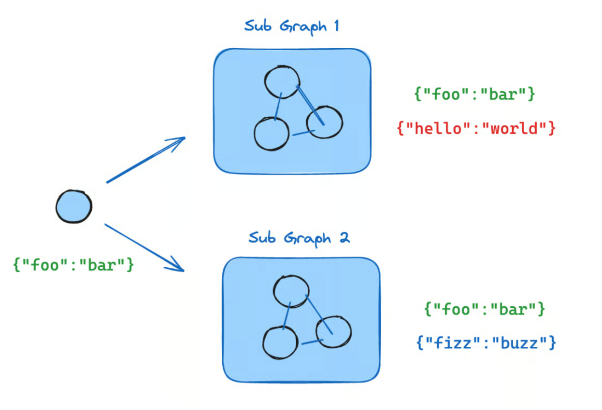

## Subgraph
Subgraph in langgraph usually means a graph that is embedded and executed as a node inside another graph.

### Why Subgraphs are needed?
- Tool calls
- RAG
- Conditional routing
- Retries
- Memory
- HITL
- Evaluation
- Guardrails

### Define subgraph communication
When adding subgraphs, you need to define how the parent graph and the subgraph communicate:
1. #### Pattern: Call a subgraph inside a node.

`When to use:` Parent and subgraph have different state schemas (no shared keys), or you need to transform state between them.

`State schemas:` You write a wrapper function that maps parent state to subgraph input and subgraph output back to parent state.

2. #### Pattern: Add a subgraph as a node.

`When to use:` Parent and subgraph share state keys—the subgraph reads from and writes to the same channels as the parent.

`State schemas:` You pass the compiled subgraph directly to add_node—no wrapper function needed.

