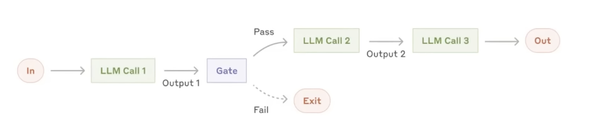
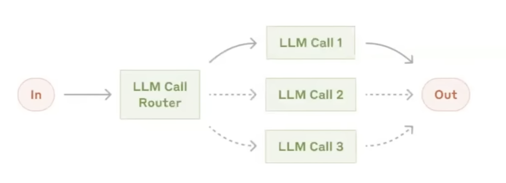
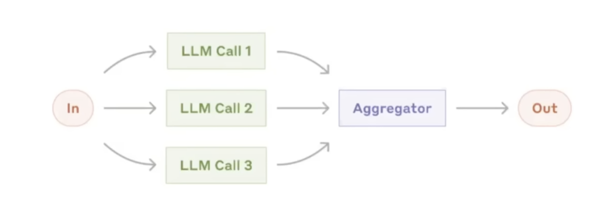
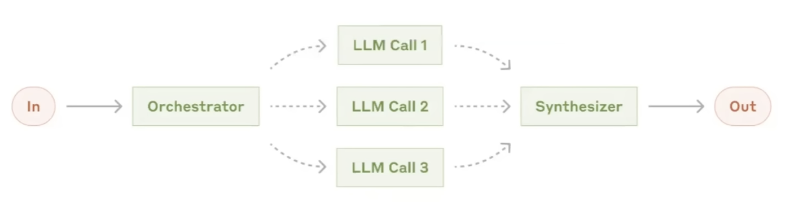
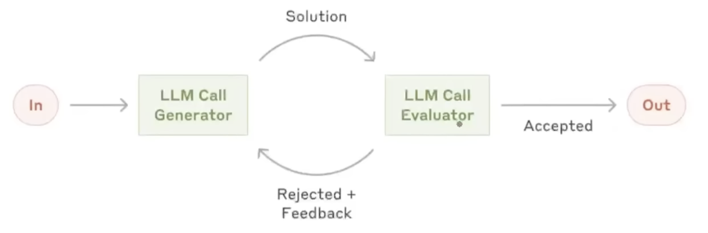

### What is LangGraph (recap)?

- LangGraph is an orchestration framework for building intelligent, stateful, and multi-step LLM workflows.
- It enables advanced features like parallelism, loops, branching, memory, and resumability — making it ideal for agentic and - production-grade Al applications.
- It models your logic as a graph of nodes (tasks) and edges (routing) instead of a linear chain.

### Core Components:

#### 1. LLM Workflows
- LLM workflows are a step by step process using which we can build complex
LLM applications.
- Each step in a workflow performs a distinct task - such as prompting, reasoning, tool calling, memory access, or decision-making.
- Workflows can be linear, parallel, branched, or looped, allowing for complex behaviours like retries, multi-agent communication, or tool-augmented reasoning.
- Common workflows
    - Prompt Chaining:
    
    - Routing:
    
    - Paralleization:
    
    - Orchestrator Workers:
    
    - Evaluator Optimizer:
    

#### 2. Graphs, Nodes and Edges
The system generates an essay topic, collects the student's submission, and evaluates it in parallel on depth of analysis, language quality, and clarity of thought. Based on the combined score, it either gives feedback for improvement or approves the essay.
1. GenerateTopic
    - System generates a relevant UPSC-style essay topic and presents it to the student.
2. CollectEssay
    - Student writes and submits the essay based on the generated topic.
3. EvaluateEssay (Parallel Evaluation Block)
    - Three evaluation tasks run in parallel:
        - EvaluateDepth - Analyzes depth of analysis, argument strength, and critical thinking.
        - EvaluateLanguage - Checks grammar, vocabulary, fluency, and tone.
        - EvaluateClarity - Assesses coherence, logical flow, and clarity of thought.
4. AggregateResults
    - Combines the three scores and generates a total score (e.g., out of 15).
5. ConditionalRouting
- Based on the total score:
    - If score meets threshold → go to ShowSuccess
    - If score is below threshold → go to GiveFeedback
6. GiveFeedback
    - Provides targeted suggestions for improvement in weak areas.
7. CollectRevision (optional loop)
    - Student resubmits the revised essay.
    - Loop back to EvaluateEssay
8. ShowSuccess
    - Congratulates the student and ends the flow.

#### 3. State
In LangGraph, state is the shared memory that flows through your workflow - it holds all the data being passed between nodes as your graph runs.

```essay_text: str
topic: str
depth_score: int
language_score: int
clarity_score: int
total_score: int
feedback: Annotated[list[str], add]
evaluation_round: int
```

State is shared and reusable. `TypedDict` is used to create states.

#### 4. Reducers
- It is closely connected to the state.
- Reducers in LangGraph define how updates from nodes are applied to the shared state.
- Each key in the state can have its own reducer, which determines whether new data replaces, merges, or adds to the existing value.

#### 5. LangGraph Execution Model
- A. Graph Definition
    - The state schema
    Nodes (functions that perform tasks)
    - Edges (which node connects to which)
- B. Compilation
You call . compile() on the StateGraph .
This checks the graph structure and prepares it for execution.
- Invocation
You run the graph with . invoke(initial_state) •
LangGraph sends the initial state as a message to the entry node(s).
- Super-Steps Begin
Execution proceeds in rounds.
5. Message Passing & Node Activation
    - The messages are passed to downstream nodes via edges.
    - Nodes that receive messages become active for the next round.
6. Halting Condition
Execution stops when:
    - No nodes are active, and
    - No messages are in transit